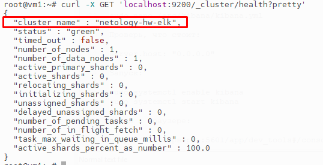
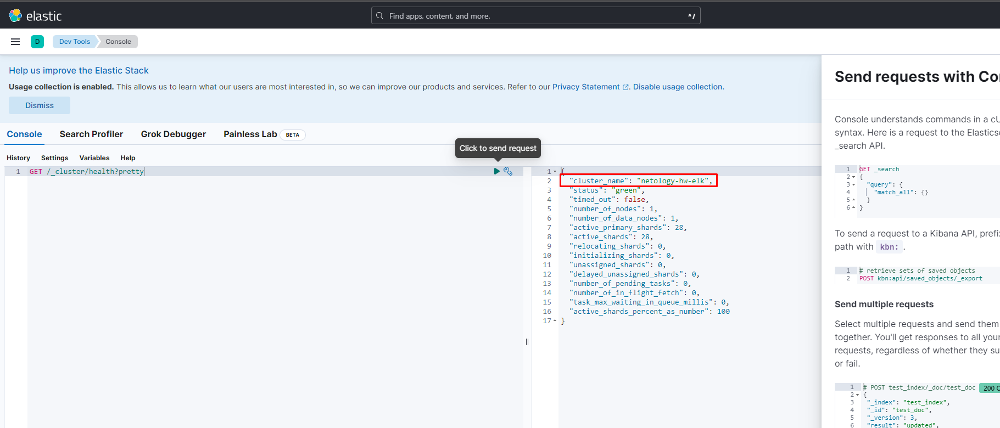
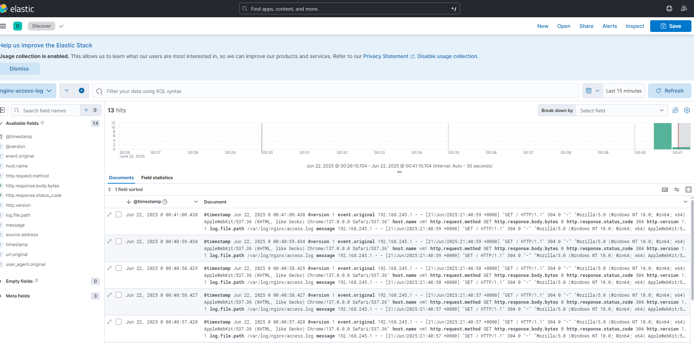
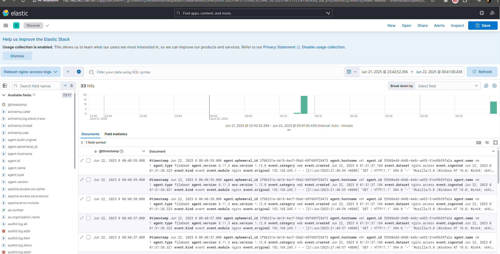

# Домашнее задание по лекции "ELK"

### Задание 1
#### Скриншот вывода запроса curl к elasticsearch
Elasticsearch 

### Задание 2
#### Скриншот с интерфейсом Kibana и результатом запроса
Kibana 

### Задание 3
#### Скриншот с логами Logstash из nginx
Logstash 

### Задание 4
#### Скриншот с логами filebeat из nginx
Filebeat 